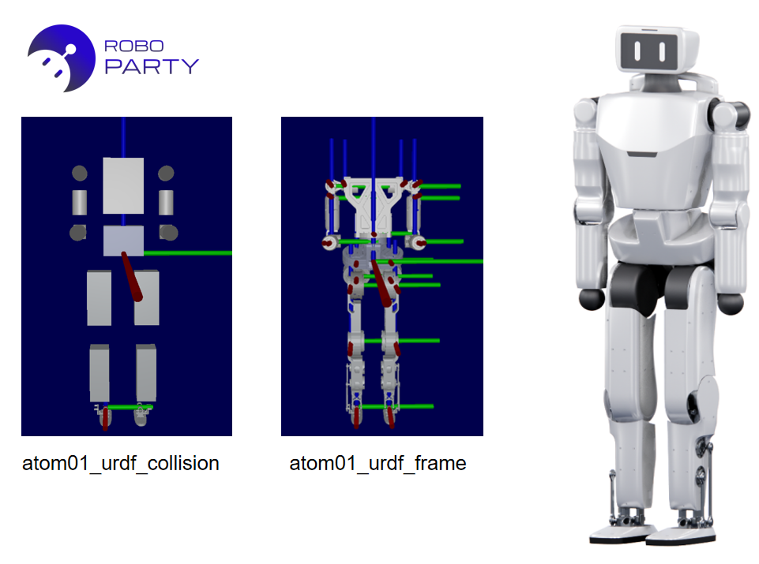

There are the description files of RPO, a product of Roboparty.

## Online URDF viewer

Use [Robot Viewer](https://viewer.robotsfan.com/) to inspect the model in a browser. Upload the entire `rpo` folder (must include `urdf/rpo.urdf` and `meshes/*.STL` so relative mesh paths resolve), then open `urdf/rpo.urdf`.
